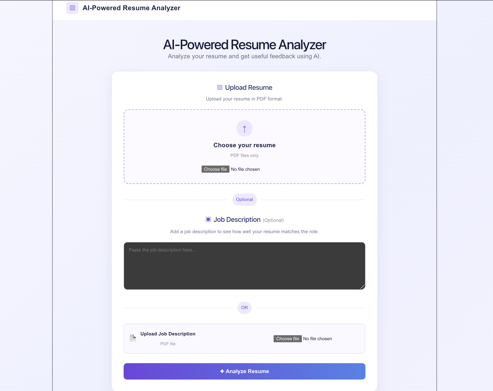
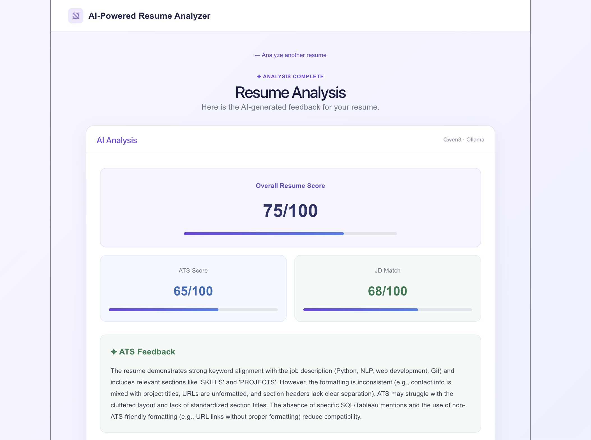
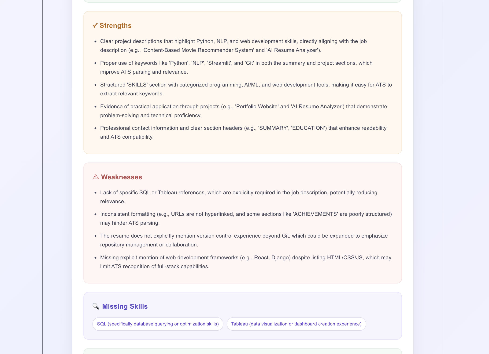
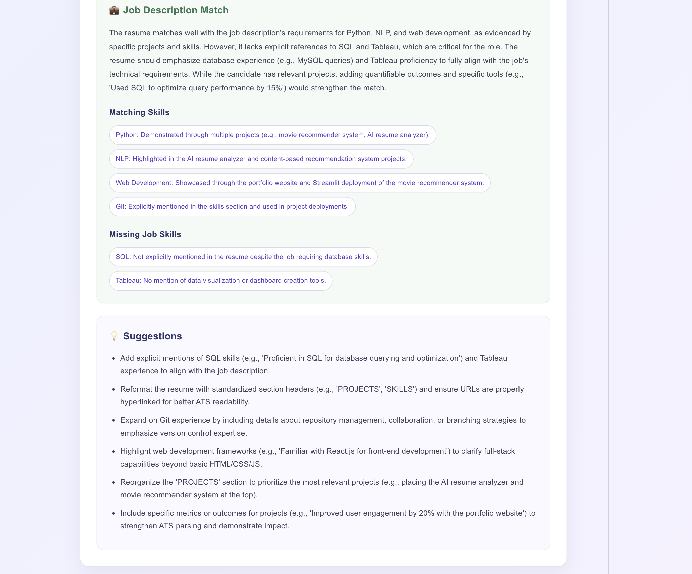

# AI-Powered Resume Analyzer

## 📌 Project Overview

The AI-Powered Resume Analyzer is a web-based application that uses a locally hosted Large Language Model (LLM) to analyze resumes and provide AI-generated feedback.

The application allows users to upload their resume in PDF format and optionally provide a job description. The system extracts the resume content, analyzes it using Qwen3 through Ollama, and presents useful feedback such as resume score, ATS compatibility, strengths, weaknesses, missing skills, and suggestions.

When a job description is provided, the application also evaluates how well the resume matches the job requirements.

---

## 📋 Table of Contents

- [Features](#-features)
- [Technologies Used](#️-technologies-used)
- [System Architecture](#️-system-architecture)
- [Application Workflow](#-application-workflow)
- [Resume Analysis](#-resume-analysis)
- [API](#-api)
- [Docker Setup](#-docker-setup)
- [Running the Project](#-running-the-project)
- [Testing](#-testing)
- [Screenshots](#-screenshots)
- [Project Structure](#-project-structure)

---

## ✨ Features

| Category | Details |
|---|---|
| Input | Upload resume in PDF format · Extract text from PDF resumes · Paste a job description · Upload a job description as a PDF |
| Resume Analysis | Overall resume score · ATS compatibility score and feedback · Identify resume strengths · Identify resume weaknesses · Identify missing skills · Actionable improvement suggestions |
| Job Description Matching | Job description match score · Matching skills identification · Missing job requirements identification |
| System | User-friendly results interface · Error handling for invalid inputs · Local AI processing using Ollama and Qwen3 · Dockerized frontend and backend |

---

## 🛠️ Technologies Used

| Layer | Technologies |
|---|---|
| Frontend | React, JavaScript, HTML, CSS |
| Backend | Python, FastAPI, PyMuPDF, Ollama |
| AI Model | Qwen3:8b, Ollama |
| Deployment | Docker, Docker Compose |

---

## 🏗️ System Architecture

The application follows a client-server architecture.

```
User
  ↓
React Frontend
  ↓
FastAPI Backend
  ↓
PDF Text Extraction
  ↓
Analysis Prompt
  ↓
Ollama
  ↓
Qwen3:8b
  ↓
Structured JSON Response
  ↓
FastAPI
  ↓
React Results Page
```

---

## 🔄 Application Workflow

| Step | Description |
|---|---|
| 1. Upload Resume | The user uploads their resume as a PDF through the React frontend. |
| 2. Optional Job Description | The user can either paste a job description or upload it as a PDF. |
| 3. Send Request | The frontend sends the resume and optional job description to the backend using a `multipart/form-data` request. |
| 4. Extract Resume Text | The FastAPI backend receives the PDF and uses PyMuPDF to extract its text. |
| 5. AI Analysis | The extracted resume content is added to a structured prompt and sent to Qwen3:8b through the locally hosted Ollama service. |
| 6. Generate Analysis | The AI evaluates the resume and returns structured information (see below). |
| 7. Display Results | The backend returns the analysis as JSON, and the React frontend displays the results in separate sections. |

**Step 6 returns:**
- Resume score
- ATS score
- ATS feedback
- Strengths
- Weaknesses
- Missing skills
- Suggestions

**If a job description is provided, it also returns:**
- JD match score
- Matching skills
- Missing job skills
- JD analysis

---

## 📊 Resume Analysis

The overall resume score is generated by the AI model based on the evaluation criteria provided in the analysis prompt. The model evaluates the resume and returns a score between 0 and 100.

The ATS analysis considers factors such as:

| Factor |
|---|
| Resume structure |
| Section organization |
| Keyword usage |
| Readability |
| Formatting |
| Possible ATS issues |

---

## 🔌 API

### `POST /upload-resume`

Uploads a resume and optionally accepts a job description.

**Inputs**

| Field | Description |
|---|---|
| `file` | Resume PDF |
| `job_description` | Optional pasted job description |
| `job_description_file` | Optional JD PDF |

**Response**

The API returns:

| Field |
|---|
| Uploaded filename |
| Extracted resume text |
| Job description |
| AI-generated analysis |

---

## 🐳 Docker Setup

The project contains separate Docker containers for the frontend and backend.

```
Docker
├── Frontend Container
└── Backend Container
```

Ollama and Qwen3 run locally on the host machine. The backend container connects to Ollama using `host.docker.internal`.

Docker Compose is used to start both application containers together.

---

## 🚀 Running the Project

### Prerequisites

Install:

- Python
- Node.js
- Ollama
- Docker Desktop

Download the Qwen3 model:

```bash
ollama pull qwen3:8b
```

### Run with Docker

Start Ollama:

```bash
ollama serve
```

In another terminal:

```bash
cd ai-powered-resume-analyzer
docker compose up --build
```

Open:

```
http://localhost:5173
```

---

## 🧪 Testing

The project includes automated tests covering:

- API availability
- PDF text extraction
- Multiple-page PDF extraction
- Resume upload
- Job description handling
- Response structure
- Invalid file types
- Empty files
- Invalid PDFs
- Ollama connection errors
- Invalid AI responses

---

## 📸 Screenshots

### Home Page


### Resume Analysis Overview


### Resume Analysis Details


### Job Description Analysis


---

## 👩‍💻 Project Structure

```
ai-powered-resume-analyzer/
│
├── backend/
│   ├── main.py
│   ├── requirements.txt
│   └── Dockerfile
│
├── frontend/
│   ├── src/
│   │   ├── App.jsx
│   │   └── App.css
│   ├── package.json
│   └── Dockerfile
│
├── tests/
│   └── test_main.py
│
├── docker-compose.yml
└── README.md
```
